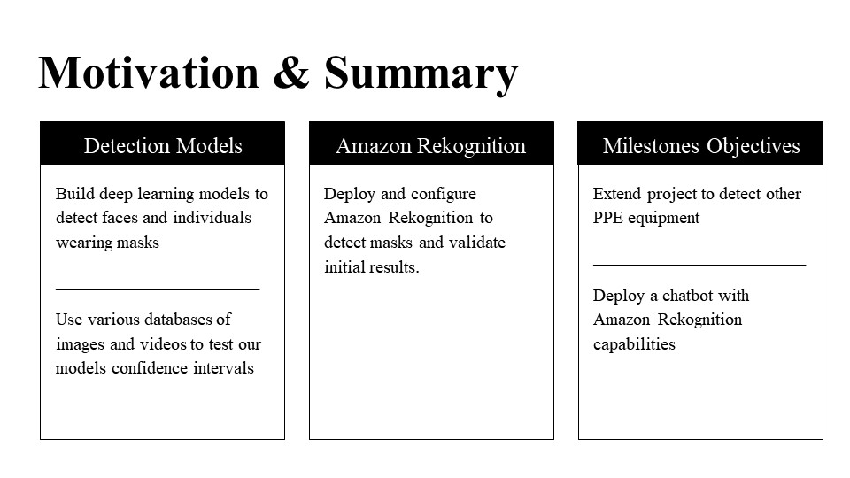
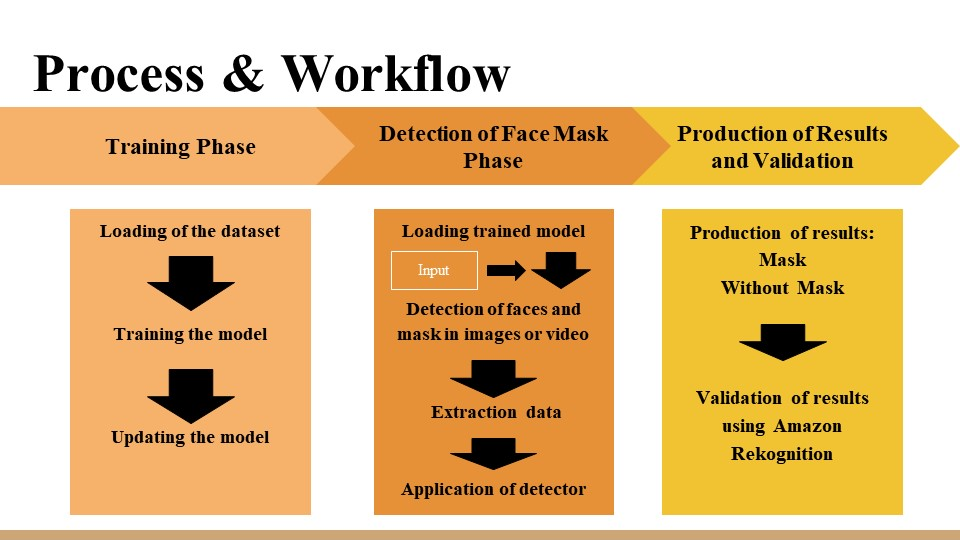
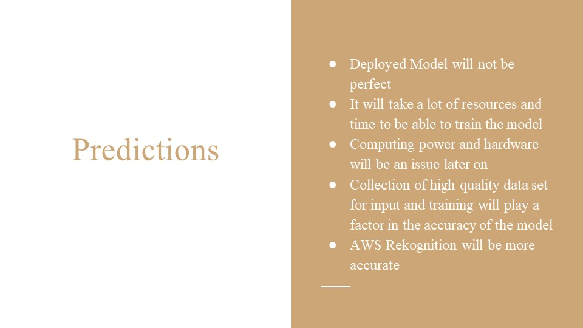
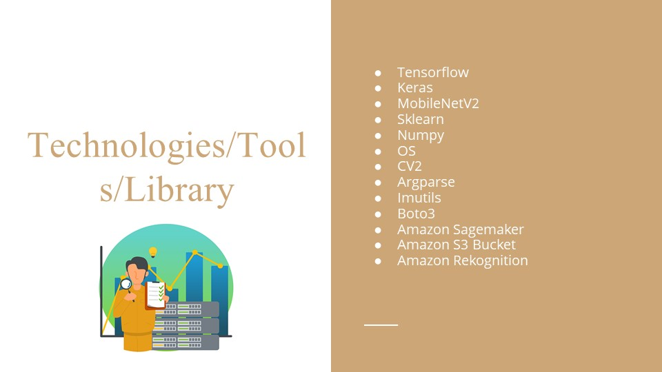
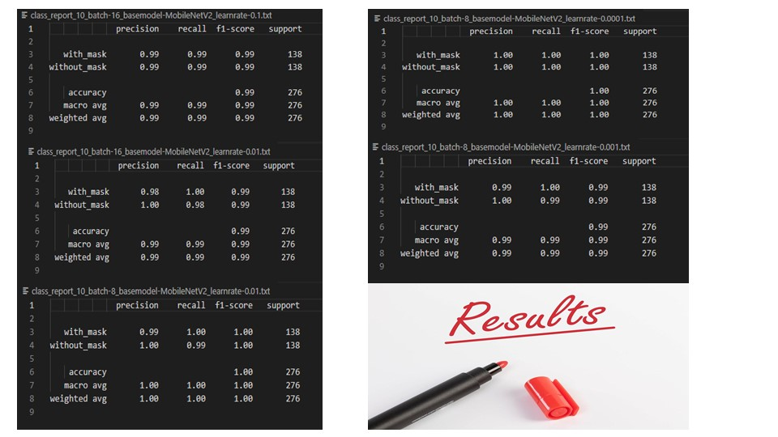
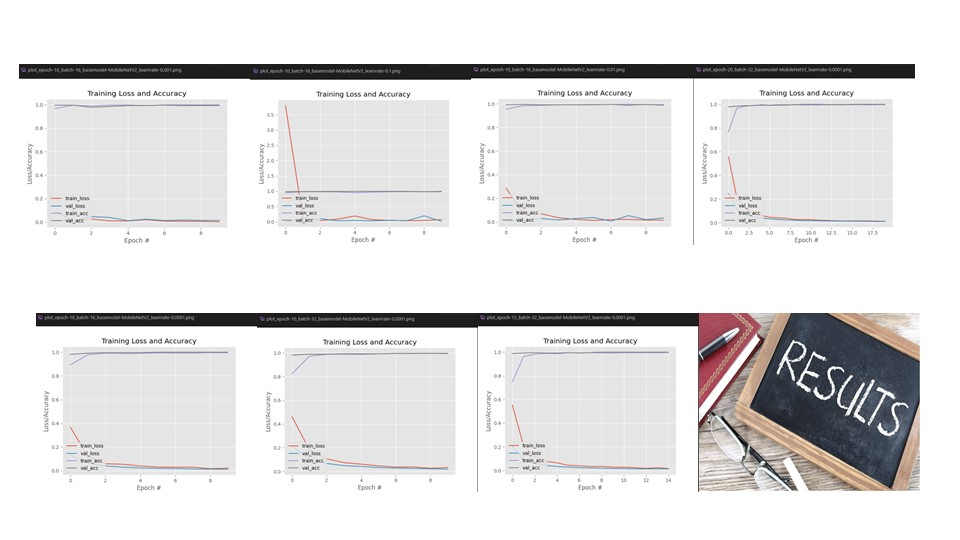
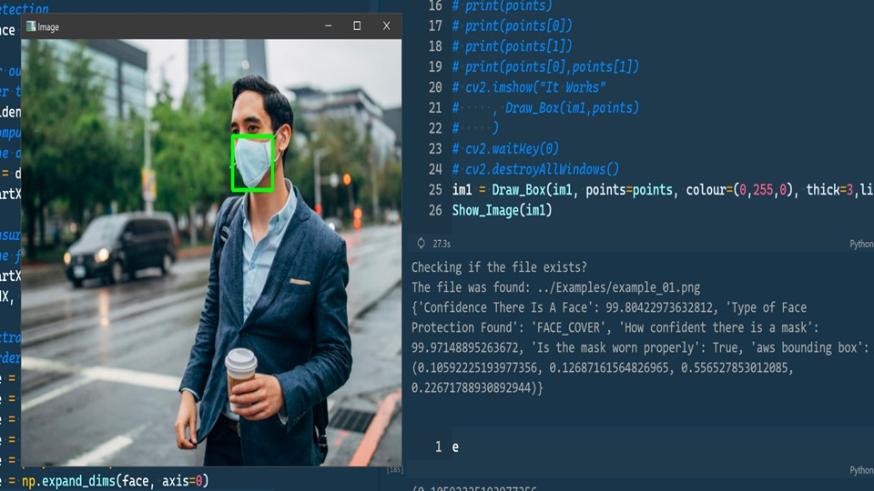
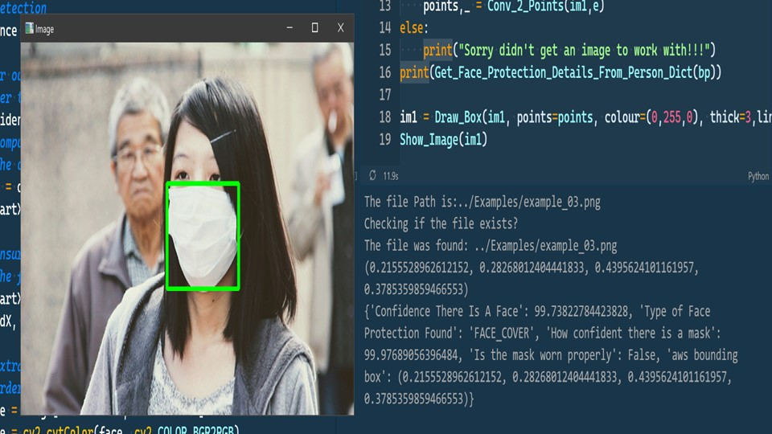
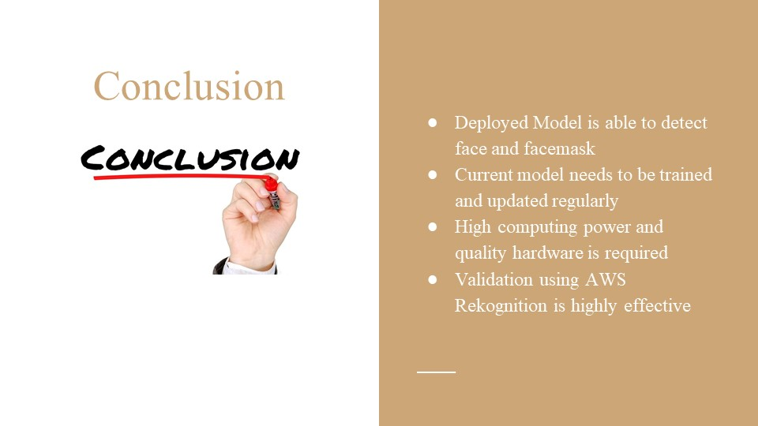
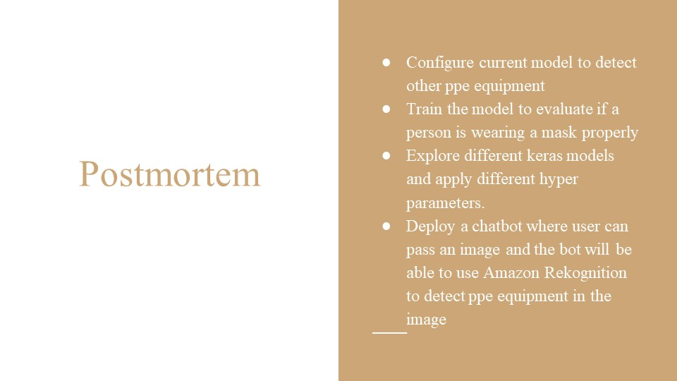

# Project-Two: Mask Detection 

## [Grace Zai](https://github.com/Gracezai) , [John Mangahas](https://github.com/AdoboPeanuts) , [Martin Mangahas](https://github.com/martsymarts) , [Ethol Palmer](https://github.com/etholpalmer) , [Monique Rowe](https://github.com/moniquerowe15)
___

## Background
___

According to the World Health Organization (2021), the COVID-19 disease is a highly contagious and pathogenic viral infection caused by a new coronavirus called SARS-CoV-2.  The WHO first learned of this new virus in December 2019, following a report of a cluster of cases of viral pneumonia in the province of Wuhan, located in the People's Republic of China. 

The COVID-19 arrival has stopped the world due to its severity and adverse effects on humans. According to the WHO, mild symptoms of COVID-19 include dry cough, tiredness, and fever. However, fever may not be a symptom for some older people. Other mild symptoms include aches and pains, nasal congestion, runny nose, sore throat or diarrhea.

Furthermore, some people can become infected but do not develop and show any symptoms. In some cases, some people recover from the disease naturally. But it does not mean that everybody is entirely safe from contracting and transmitting the disease. One out of six people who get COVID-19 becomes seriously ill (Centers for Disease Control and Prevention, 2021).

According to CDC (2021), the recovery period for patients with acute symptoms depends on severity. A person should stay quarantined or be in self-isolation if affected by a coronavirus. Getting the covid-19 vaccination is highly advised to curb the spread of the virus but is not mandatory. 

The whole world is putting a lot of time into research to increase the efficacy of vaccines and treatments for the novel coronavirus. Understanding how to treat the virus and keep it from spreading is also an issue we currently face. 

Since covid-19 vaccination is not mandatory, most country's governing bodies still highly advise people to get vaccinations and continue to practice proper social distancing protocols. The WHO and the CDC have also suggested using face masks to decrease the spread of the virus. 

Face masks effectively trapping the droplets discharged from a person's mouth while communicating, sneezing, or coughing. Facemask is most effective when it covers the mouth and the nose to trap the water droplets. 

Our facemask model aims to detect whether or not a person is wearing a mask or not. 

____

____

____

____

____
----
# Metrics

Class Report for different basemodels with varying hyperparameters
----

____

# Visual Outputs

____

____

____

____
# Demo Notebook [FaceMaskDetection](Demo.ipynb)

## 1. Make sure to input valid amazon aws user key id and secret key
## 2. Use .env protocol to load your keys
____
# How to Setup AWS Rekognition

## 1. Create an IAM user with programmatic access
## 2. Attached the following policies to the user;
     a. AmazonS3FullAccess
     b. AmazoRekognitionFullAccess
## 3. Make sure the access key id and secret access key is valid
## 4. Follow instructions on how to pass an image locally inside the provided notebook [AWS-LOCAL](aws-rekognition/aws-local.ipynb)
## 5. Follow instructions on how to pass an image via S3 Bucket inside the provided notebook [AWS-CLOUD](aws-rekognition/aws-cloud.ipynb)
____
## Resources

[Centers for Disease Control and Prevention](https://www.cdc.gov/coronavirus/2019-ncov/index.html)

[Keras.io](https://keras.io/api/applications/#usage-examples-for-image-classification-models)

[Pixabay](https://pixabay.com)

[World Health Organization](https://www.who.int/emergencies/diseases/novel-coronavirus-2019?gclid=CjwKCAjw4KyJBhAbEiwAaAQbE3O7yveOsQJ_C1R67BxYZAaP6GEBrZaySy3sUnYLsotZm_bRZC4rKBoCCsQQAvD_BwE)

